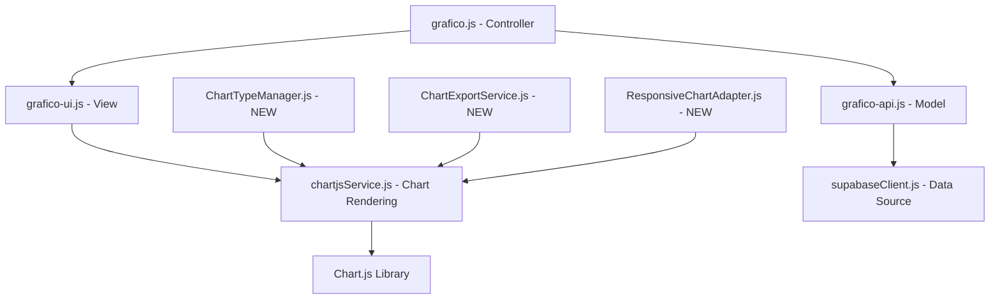
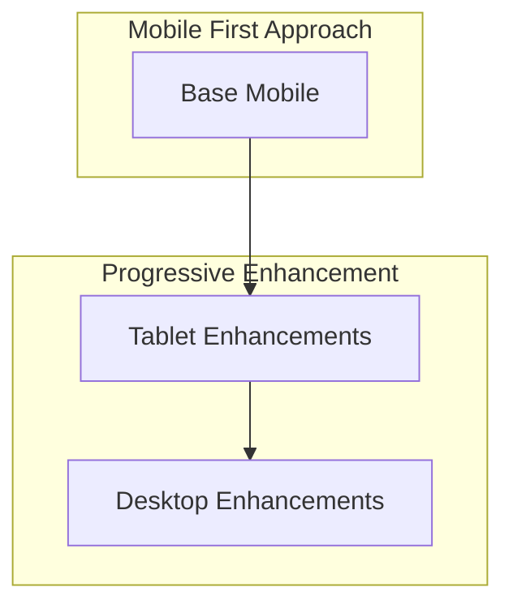

# Design Document: Miglioramento Grafici

## Overview

Questo documento descrive il design tecnico per l'implementazione dei miglioramenti ai grafici dell'applicazione, sia per dispositivi mobili che desktop. L'obiettivo è creare un'esperienza utente ottimizzata per entrambe le piattaforme, migliorare le prestazioni e aggiungere nuove funzionalità che rendano i grafici più utili e interattivi.

## Architettura

L'architettura del sistema di grafici seguirà un pattern MVC (Model-View-Controller) modificato per adattarsi alla struttura esistente dell'applicazione:



### Componenti Principali

1. **Controller (grafico.js)**: Coordina l'interazione tra il modello e la vista
2. **View (grafico-ui.js)**: Gestisce l'interfaccia utente e gli eventi
3. **Model (grafico-api.js)**: Gestisce l'accesso ai dati e la loro manipolazione
4. **Chart Rendering (chartjsService.js)**: Gestisce il rendering dei grafici
5. **ChartTypeManager.js (NUOVO)**: Gestisce i diversi tipi di grafici
6. **ChartExportService.js (NUOVO)**: Gestisce l'esportazione e la condivisione dei grafici
7. **ResponsiveChartAdapter.js (NUOVO)**: Gestisce l'adattamento dei grafici a diverse dimensioni dello schermo

## Componenti e Interfacce

### 1. ChartTypeManager

```javascript
/**
 * Gestisce i diversi tipi di grafici disponibili
 */
class ChartTypeManager {
  /**
   * Inizializza il manager con i tipi di grafici supportati
   */
  constructor() {
    this.chartTypes = {
      pie: { name: 'Torta', renderer: this.renderPieChart },
      bar: { name: 'Barre', renderer: this.renderBarChart },
      line: { name: 'Linee', renderer: this.renderLineChart }
    };
    this.currentType = 'pie';
  }
  
  /**
   * Cambia il tipo di grafico
   * @param {string} type - Il tipo di grafico da utilizzare
   */
  setChartType(type) {...}
  
  /**
   * Renderizza il grafico del tipo corrente
   * @param {HTMLElement} container - Il container dove renderizzare il grafico
   * @param {Array} data - I dati da visualizzare
   * @param {Object} options - Opzioni di configurazione
   */
  renderChart(container, data, options) {...}
  
  // Metodi specifici per ogni tipo di grafico
  renderPieChart(container, data, options) {...}
  renderBarChart(container, data, options) {...}
  renderLineChart(container, data, options) {...}
}
```

### 2. ChartExportService

```javascript
/**
 * Gestisce l'esportazione e la condivisione dei grafici
 */
class ChartExportService {
  /**
   * Esporta il grafico come immagine
   * @param {Chart} chart - L'istanza del grafico da esportare
   * @param {string} format - Il formato dell'immagine (png/jpg)
   * @param {Object} metadata - Metadati da includere nell'immagine
   * @returns {Promise<Blob>} - L'immagine come Blob
   */
  exportAsImage(chart, format = 'png', metadata = {}) {...}
  
  /**
   * Genera un link condivisibile per il grafico
   * @param {Object} filters - I filtri applicati al grafico
   * @param {string} chartType - Il tipo di grafico
   * @returns {string} - URL condivisibile
   */
  generateShareableLink(filters, chartType) {...}
  
  /**
   * Invia il grafico via email
   * @param {Blob} imageBlob - L'immagine del grafico
   * @param {string} emailAddress - L'indirizzo email del destinatario
   * @param {Object} metadata - Metadati da includere nell'email
   * @returns {Promise<boolean>} - Esito dell'invio
   */
  shareViaEmail(imageBlob, emailAddress, metadata) {...}
}
```

### 3. ResponsiveChartAdapter

```javascript
/**
 * Adatta i grafici a diverse dimensioni dello schermo
 */
class ResponsiveChartAdapter {
  /**
   * Inizializza l'adapter
   * @param {Object} breakpoints - I breakpoint per i diversi dispositivi
   */
  constructor(breakpoints = {
    mobile: 767,
    tablet: 991,
    desktop: 1199
  }) {
    this.breakpoints = breakpoints;
    this.currentDevice = this.detectDevice();
  }
  
  /**
   * Rileva il tipo di dispositivo corrente
   * @returns {string} - Il tipo di dispositivo (mobile/tablet/desktop)
   */
  detectDevice() {...}
  
  /**
   * Adatta le opzioni del grafico al dispositivo corrente
   * @param {Object} options - Le opzioni originali del grafico
   * @returns {Object} - Le opzioni adattate
   */
  adaptOptions(options) {...}
  
  /**
   * Adatta il layout del grafico al dispositivo corrente
   * @param {HTMLElement} container - Il container del grafico
   */
  adaptLayout(container) {...}
  
  /**
   * Gestisce il ridimensionamento della finestra
   * @param {Chart} chart - L'istanza del grafico
   * @param {Object} options - Le opzioni originali del grafico
   */
  handleResize(chart, options) {...}
}
```

## Data Models

### ChartData

```javascript
/**
 * Modello per i dati del grafico
 */
class ChartData {
  /**
   * @param {Array} rawData - I dati grezzi dal database
   * @param {string} labelField - Il campo da usare come etichetta
   * @param {string} valueField - Il campo da usare come valore
   */
  constructor(rawData, labelField, valueField) {
    this.rawData = rawData;
    this.labelField = labelField;
    this.valueField = valueField;
    this.processedData = this.processData();
  }
  
  /**
   * Processa i dati grezzi in un formato utilizzabile dai grafici
   * @returns {Object} - I dati processati
   */
  processData() {...}
  
  /**
   * Formatta i dati per un grafico a torta
   * @returns {Object} - I dati formattati per Chart.js
   */
  formatForPieChart() {...}
  
  /**
   * Formatta i dati per un grafico a barre
   * @returns {Object} - I dati formattati per Chart.js
   */
  formatForBarChart() {...}
  
  /**
   * Formatta i dati per un grafico a linee
   * @returns {Object} - I dati formattati per Chart.js
   */
  formatForLineChart() {...}
}
```

### ChartOptions

```javascript
/**
 * Modello per le opzioni del grafico
 */
class ChartOptions {
  /**
   * @param {string} chartType - Il tipo di grafico
   * @param {string} device - Il tipo di dispositivo
   * @param {Object} customOptions - Opzioni personalizzate
   */
  constructor(chartType, device, customOptions = {}) {
    this.chartType = chartType;
    this.device = device;
    this.customOptions = customOptions;
    this.options = this.buildOptions();
  }
  
  /**
   * Costruisce le opzioni per il grafico
   * @returns {Object} - Le opzioni complete
   */
  buildOptions() {...}
  
  /**
   * Ottiene le opzioni specifiche per il tipo di grafico
   * @returns {Object} - Le opzioni specifiche
   */
  getChartTypeSpecificOptions() {...}
  
  /**
   * Ottiene le opzioni specifiche per il dispositivo
   * @returns {Object} - Le opzioni specifiche
   */
  getDeviceSpecificOptions() {...}
  
  /**
   * Applica le opzioni personalizzate
   * @param {Object} baseOptions - Le opzioni di base
   * @returns {Object} - Le opzioni con personalizzazioni applicate
   */
  applyCustomOptions(baseOptions) {...}
}
```

## Error Handling

Il sistema implementerà una gestione degli errori robusta per garantire un'esperienza utente fluida anche in caso di problemi:

1. **Errori di Caricamento Dati**:
   - Visualizzazione di messaggi di errore user-friendly
   - Retry automatico con backoff esponenziale
   - Fallback a dati cached se disponibili

2. **Errori di Rendering**:
   - Fallback a tipi di grafico più semplici in caso di errori
   - Logging dettagliato per debugging
   - Notifica all'utente con opzioni di risoluzione

3. **Errori di Esportazione**:
   - Gestione di errori di generazione immagine
   - Fallback a risoluzione inferiore se necessario
   - Feedback chiaro all'utente sul problema

```javascript
/**
 * Gestisce gli errori relativi ai grafici
 */
class ChartErrorHandler {
  /**
   * Gestisce un errore di caricamento dati
   * @param {Error} error - L'errore originale
   * @param {HTMLElement} container - Il container dove mostrare l'errore
   * @param {Function} retryCallback - Funzione da chiamare per riprovare
   */
  handleDataLoadError(error, container, retryCallback) {...}
  
  /**
   * Gestisce un errore di rendering
   * @param {Error} error - L'errore originale
   * @param {HTMLElement} container - Il container dove mostrare l'errore
   * @param {Object} fallbackOptions - Opzioni per il fallback
   */
  handleRenderError(error, container, fallbackOptions) {...}
  
  /**
   * Gestisce un errore di esportazione
   * @param {Error} error - L'errore originale
   * @param {Function} notifyUser - Funzione per notificare l'utente
   */
  handleExportError(error, notifyUser) {...}
}
```

## Testing Strategy

La strategia di testing per i miglioramenti ai grafici includerà:

### 1. Unit Testing

- Test per ogni componente (ChartTypeManager, ChartExportService, ResponsiveChartAdapter)
- Test per la manipolazione dei dati e la formattazione
- Test per la gestione degli errori

### 2. Integration Testing

- Test dell'integrazione tra i componenti
- Test dell'integrazione con Chart.js
- Test dell'integrazione con il sistema di filtri esistente

### 3. Responsive Testing

- Test su diverse dimensioni dello schermo
- Test su diversi dispositivi (mobile, tablet, desktop)
- Test di orientamento (portrait/landscape)

### 4. Performance Testing

- Test di caricamento con diversi volumi di dati
- Test di interattività e reattività
- Test di memoria e CPU usage

### 5. User Acceptance Testing

- Test con utenti reali su diversi dispositivi
- Raccolta feedback su usabilità e design
- Iterazioni basate sul feedback

## Implementazione Mobile-First

L'implementazione seguirà un approccio mobile-first per garantire un'esperienza ottimale su tutti i dispositivi:

1. **Base Mobile**:
   - Layout ottimizzato per schermi piccoli
   - Controlli touch-friendly
   - Performance ottimizzata

2. **Miglioramenti per Tablet**:
   - Layout ibrido
   - Maggiori dettagli nei tooltip
   - Legenda posizionata strategicamente

3. **Miglioramenti per Desktop**:
   - Layout completo con legenda a lato
   - Interazioni avanzate (hover, click, zoom)
   - Visualizzazioni dettagliate



## Ottimizzazioni di Performance

Per garantire prestazioni ottimali, implementeremo:

1. **Lazy Loading** della libreria Chart.js
2. **Caching** dei dati e delle configurazioni
3. **Throttling** degli eventi di resize
4. **Debouncing** degli eventi di interazione
5. **Code Splitting** per caricare solo il necessario
6. **Ottimizzazione delle animazioni** per dispositivi meno potenti

## Considerazioni di Accessibilità

Per garantire che i grafici siano accessibili a tutti gli utenti:

1. **Contrasto** adeguato tra colori
2. **Testo alternativo** per elementi grafici
3. **Navigazione da tastiera** per interazioni
4. **Screen reader** supporto con descrizioni appropriate
5. **Modalità ad alto contrasto** per utenti con problemi di vista